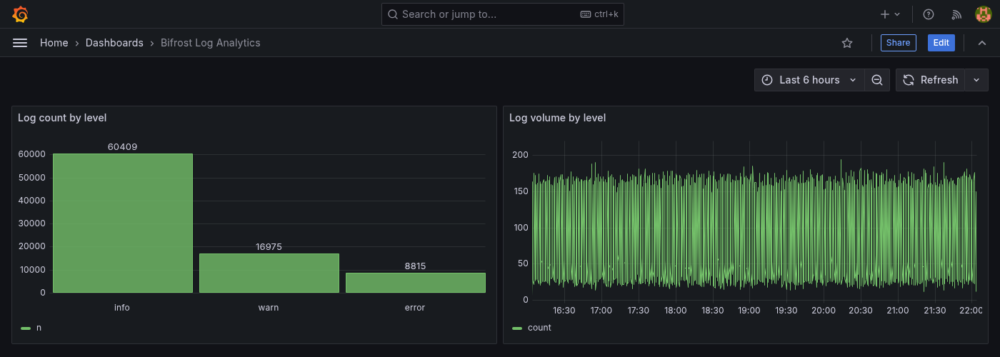
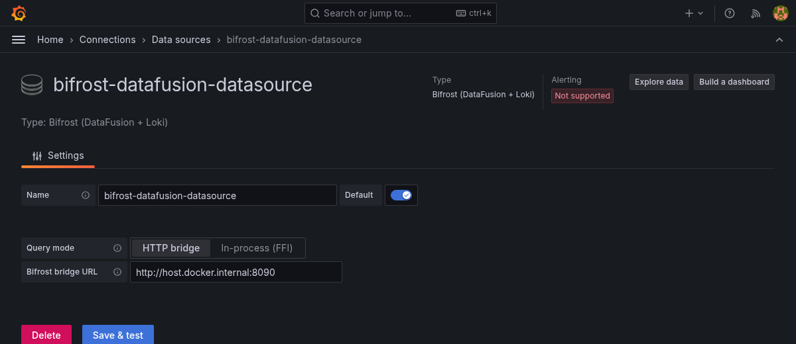
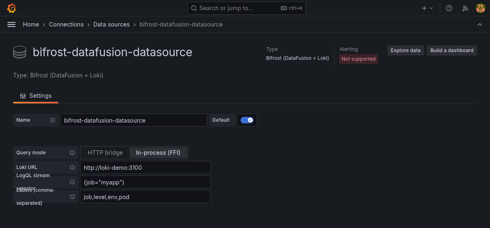

# Bifrost

**Query Grafana Loki with SQL.** Bifrost is an [Apache DataFusion](https://datafusion.apache.org/)
`TableProvider` that translates SQL into [LogQL](https://grafana.com/docs/loki/latest/query/)
and streams results back as Arrow — plus a Grafana datasource plugin so you can point
dashboards at it directly, no migration required.

Your logs stay in Loki. You get `GROUP BY`, joins, window functions, and every BI tool or
notebook that already speaks SQL, on top of a Loki deployment you already run.

<p>
  
</p>

## Why

LogQL is a log *query* language, not an analytical one — no `GROUP BY`, no multi-column
joins, no way to break an aggregate out by an arbitrary label combination in a single
request. Past "filter and count within one query," you're normally pulling raw results out
of Loki and aggregating them yourself. Bifrost hands that work to DataFusion's real SQL
engine instead:

- **`GROUP BY` on labels and derived expressions** — `SELECT level, pod, COUNT(*) FROM logs
  GROUP BY level, pod` breaks volume down by every label combination in one query.
- **Time-bucketed aggregation** — `GROUP BY date_trunc('minute', timestamp), level` for a
  per-minute, per-level breakdown as one relational result set, which is exactly what
  powers the dashboard above.
- **Joins** — a Loki-backed table against another registered table (a CSV of deploy
  events, another Loki selector) in the same query. LogQL has no equivalent at all.
- **Window functions, `HAVING`, subqueries** — standard SQL DataFusion already implements.
- **`IN` / `OR` as ordinary SQL** — `level IN ('error', 'warn')` instead of hand-rolling a
  LogQL regex alternation.
- **One query surface across tools** — anything that speaks SQL can query Loki without
  learning LogQL.

The tradeoff is explicit: only predicates in the
[pushdown reference](ARCHITECTURE.md#pushdown-reference) reach Loki as LogQL; everything
else runs in DataFusion after fetching matching rows over HTTP. Bifrost is a SQL
translation layer in front of Loki, not a new storage engine — it inherits Loki's
performance characteristics rather than replacing them. See
[Performance envelope](ARCHITECTURE.md#performance-envelope) in the architecture doc for
where that tradeoff stops making sense (short version: this is for seconds-scale
interactive analytics on data you already have in Loki, not sub-second aggregation over
billions of rows — that's what dedicated OLAP stores like ClickHouse are for).

## Quick start

**As a Rust library:**

```rust,no_run
use std::sync::Arc;
use datafusion::prelude::SessionContext;
use datafusion_loki::{LokiConfig, LokiTableProvider};

#[tokio::main]
async fn main() -> Result<(), Box<dyn std::error::Error>> {
    let config = LokiConfig::new("http://localhost:3100", r#"{job="myapp"}"#);
    let provider = LokiTableProvider::new(config, vec!["job".into(), "level".into(), "pod".into()]);

    let ctx = SessionContext::new();
    ctx.register_table("logs", Arc::new(provider))?;

    let df = ctx
        .sql(r#"
            SELECT timestamp, line, level
            FROM logs
            WHERE level = 'error' AND line LIKE '%panic%'
            ORDER BY timestamp DESC
            LIMIT 100
        "#)
        .await?;

    df.show().await?;
    Ok(())
}
```

Grafana Cloud Loki uses Basic Auth (`with_basic_auth(instance_id, token)`); self-hosted
multi-tenant Loki uses `with_tenant_id`. See [ARCHITECTURE.md](ARCHITECTURE.md#design-notes)
for the details.

**As a Grafana datasource:** install `grafana-plugin/`, add a "Bifrost (DataFusion + Loki)"
datasource, and write SQL directly in your panels:

<p>
  
</p>

```sql
SELECT date_trunc('minute', timestamp) AS time, level, COUNT(*) AS count
FROM logs
WHERE $__timeFilter(timestamp)
GROUP BY time, level
ORDER BY time
```

`$__timeFilter(timestamp)` wires up Grafana's time range picker — see
[ARCHITECTURE.md](ARCHITECTURE.md#the-dashboard-time-picker-does-nothing-by-default) for
why that's opt-in rather than automatic (same convention as Grafana's official SQL
datasources).

Full install/build steps: [`grafana-plugin/README.md`](grafana-plugin/README.md).

**Or skip building entirely** — pull the pre-built images from Docker Hub:

```sh
# Grafana with the Bifrost plugin pre-installed
docker run -d --name grafana -p 3000:3000 \
  --add-host=host.docker.internal:host-gateway \
  eviking/bifrost-grafana

# The HTTP bridge it talks to by default
docker run -d --name bifrost-bridge -p 8090:8090 \
  -e LOKI_URL=http://host.docker.internal:3100 \
  eviking/bifrost-bridge
```

Then add a "Bifrost (DataFusion + Loki)" datasource pointing at `http://host.docker.internal:8090`.
See [Docker images](#docker-images) below for the full set and what each one is for.

## Two ways to run queries

Bifrost ships two interchangeable query engines behind the same Grafana plugin, selected
with a toggle in the datasource config — no rebuild needed to switch:

<p>
  
</p>

- **HTTP bridge** (default, supported) — the plugin calls out to `bridge/`, a small Rust
  process embedding this crate, over HTTP.
- **In-process (FFI)** (experimental) — `LokiTableProvider` loads directly into the Go
  plugin's own process via [`datafusion-ffi`](https://crates.io/crates/datafusion-ffi),
  zero HTTP hops to a separate process. Verified working end-to-end on macOS and inside a
  real Grafana Docker container, but depends on an unreleased `datafusion-go` commit and a
  from-source cgo build — see [ARCHITECTURE.md](ARCHITECTURE.md#in-process-ffi-mode) for
  the full story.

## Docker images

Four images are published to Docker Hub under [`eviking/`](https://hub.docker.com/u/eviking):

| Image | What it is |
|---|---|
| [`eviking/bifrost-grafana`](https://hub.docker.com/r/eviking/bifrost-grafana) | Grafana with the plugin pre-installed, defaults to HTTP bridge mode |
| [`eviking/bifrost-grafana-ffi`](https://hub.docker.com/r/eviking/bifrost-grafana-ffi) | Same, but defaults to In-process (FFI) mode with the native libraries pre-wired — no manual library mounting |
| [`eviking/bifrost-bridge`](https://hub.docker.com/r/eviking/bifrost-bridge) | The standalone HTTP bridge process (`bridge/`) |
| [`eviking/bifrost-builder`](https://hub.docker.com/r/eviking/bifrost-builder) | Rust + Go + cgo toolchain for building the FFI native libraries and plugin binaries yourself |

Both Grafana images can run either query mode — the difference is only which one is the
default and, for `-ffi`, whether `datafusion-go`'s native library is already built in.
Both are built on `grafana/grafana:11.3.0-ubuntu` (glibc), since the plugin's cgo-based
FFI package needs a glibc-linked native library to be present at runtime regardless of
which query mode a given datasource actually uses — see
[ARCHITECTURE.md](ARCHITECTURE.md#in-process-ffi-mode) for why.

Dockerfiles for all four live in [`docker/`](docker/); see
[`docker/README.md`](docker/README.md) for build recipes, including how to use
`eviking/bifrost-builder` to reproduce the FFI native libraries and plugin binaries
without installing Rust/Go/cgo locally.

## Try it yourself

Verified end-to-end against a real `grafana/loki:3.1.0` container, not just mocks:

```sh
# 1. Start Loki
docker run -d --name loki-demo -p 3100:3100 grafana/loki:3.1.0 \
  -config.file=/etc/loki/local-config.yaml

# 2. Push some sample log data
python3 scripts/push_logs.py --continuous   # keeps pushing so panels don't go stale

# 3. Query it
LOKI_URL=http://localhost:3100 cargo run --example query_loki
LOKI_URL=http://localhost:3100 cargo run --example demo_map_and_agg
```

`examples/query_loki.rs` runs a query with a label filter and a line filter together;
Loki's own server logs confirm both were translated into LogQL and evaluated by Loki
itself, not fetched in bulk and filtered client-side:

```
query="{job=\"myapp\", level=\"error\"} |= \"panic\""
```

## Status

From-scratch implementation targeting DataFusion 53.1.0 / Arrow 58.4.0. 24 unit tests + 10
integration tests (mocked Loki via `wiremock`) + doctests all pass with zero warnings, plus
end-to-end verification against a real Loki instance and a real Grafana deployment. See
[ARCHITECTURE.md](ARCHITECTURE.md#status--caveats) for the full caveats list — the honest
version of what this does and doesn't do at scale.

## Learn more

- **[ARCHITECTURE.md](ARCHITECTURE.md)** — how the pushdown works, the full pushdown
  reference table, schema modes, pagination/ordering semantics, the two Grafana query
  engines in depth, and version-pinning rationale.
- **[`grafana-plugin/README.md`](grafana-plugin/README.md)** — installing and building the
  Grafana plugin, including the In-process (FFI) mode's build steps.
- **[`docker/README.md`](docker/README.md)** — building and pushing the four published
  Docker images, and using `eviking/bifrost-builder` to get the FFI native libraries
  without installing Rust/Go/cgo locally.
- **[`bridge/`](bridge/)** — the small Rust HTTP service the default query mode talks to.
- **[`ffi-export/`](ffi-export/)** and **[`ffi-go-poc/`](ffi-go-poc/)** — the Rust FFI
  export crate and a minimal standalone Go reproduction of in-process mode.

## License

Licensed under the [Apache License, Version 2.0](LICENSE).
